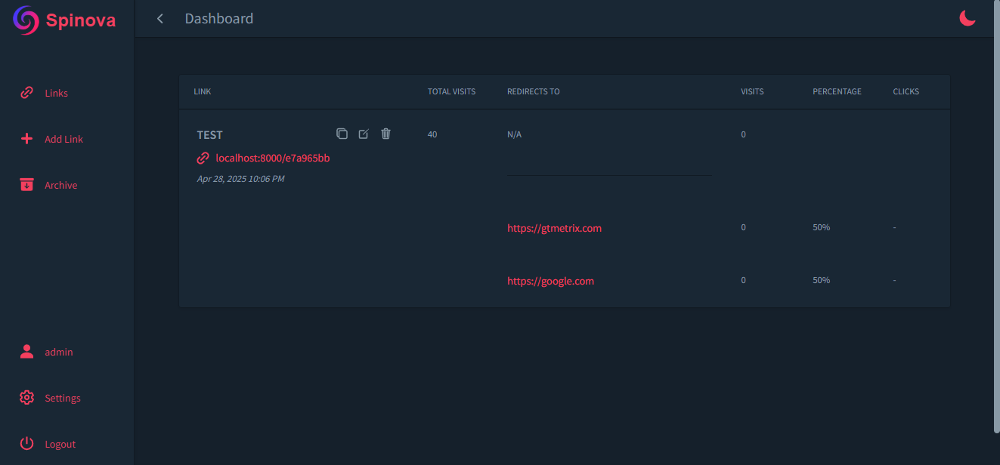

# Spinova URL Rotator

A high-performance PHP application for managing and redirecting URLs with click tracking and percentage-based distribution.

## 📷 Screenshot



## Features

- 🚀 **Fast redirects** - Average response time under 20ms
- ⚖️ **Two redirect modes**:
  - Percentage-based distribution
  - Click-limited destinations
- 📊 **Tracking**:
  - Total visits per link
  - Individual destination visits
- 🗄️ **Link management**:
  - Create/edit/archive links
  - Set default fallback URLs
- 🔒 **Secure**:
  - Prepared statements
  - Input validation

## Performance Optimizations

- Single-query data fetching
- Atomic transaction handling
- Efficient weighted random algorithm
- Minimal database roundtrips


## Installation

1. **Requirements**:
   - PHP 8.0+
   - MySQL 5.7+ (XAMPP)

2. **Setup**:
   open phpmyadmin XAMPP 
   init your database with spinova.sql
   ```bash
   git clone https://github.com/AlaBhs/Spinova.git
   cd Spinova
   php -S localhost:8000 server.php

## 📄 License

MIT License – [AlaBhs](https://github.com/AlaBhs)
